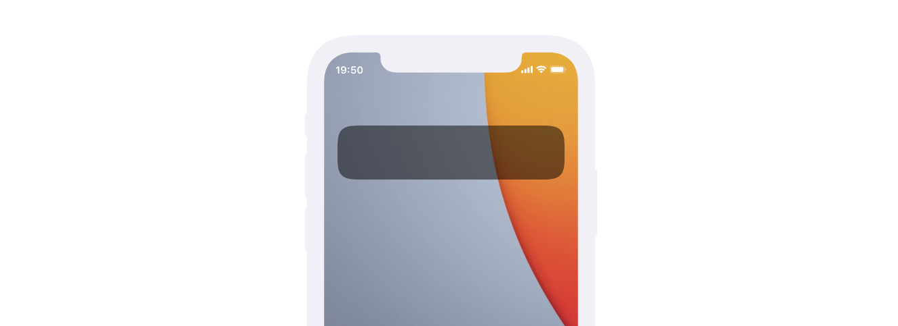

# vue-squircle
 Smooth rounded corners (like iOS) for Vue.

## Screenshot
 

This project was inspired by [this Medium post](https://medium.com/@zubryjs/squircles-bringing-ios-7s-solution-to-rounded-rectangles-to-css-9fc35779aa65) which unfortunately—like most attempts—doesn't account for rectangles other than squares.

## Installation and Use
Install the npm package
```
$ npm install vue-squircle
```


Import it into your Vue.js project
```
import VSquircle from "vue-squircle";
import Vue from "vue";

Vue.use(VSquircle);
```

And use it like this
```
<v-squircle
 radius="40px"
 :smoothing="10"
 padding="20rem"
 background="red" >
    Your content goes here!
</v-squircle>
```

## Props
When you use `<v-squircle>` elements, you can use different props to change the look of your smooth rounded background.

* `radius` and `padding` are Strings and their default value is `"25px"`.
* `smoothing` is a Number and the default value is `4`.
* `background` is a String and the default value is `hsla(0,0%,0%,0.5)`, but it could also be an image.

## TODOs
I will add background-blur filter options soon.
